# humans web

Humans is a website where you can see photos of beauty and how people in villages go about their daily lives.

## table of content

- [Intorduction](#introduction)
- [features](#features)
- [usage](#usage)
- [license](#license)

## introduction

is a website where you can see a collection of photos of people who live in villages. For those of us who live in the hustle and bustle of urban areas, we certainly want the tranquility of being in a village. Therefore, this website provides a collection of photos for those of you who want to see the beauty and tranquility of the village. Apart from that, this time I will write about the Netlify sign up process and how to connect your Netlify account with a GitHub account, auto deploy GitHub with Netlify, and connect custom domains and DNS.

## Features

- **Photos List :** given photos about people on village.
- **Request photos :** requst photo of village.
- **how to use netlyfy :** given information how to use netlify.\
- **how to use custom domain :** given information how to use custom domain and how to buy it.

## Usage

- **Netlify Sign up & Connect with Github**

1. First thing open https://app.netlify.com/
   
2. After that chose what you want to login. In this case I am login using GitHub.
   
3. Finaly, you logged into the web !!.
   

<br>

- **Auto Deployment on Github with Netlify**

1. First, open your netlify
   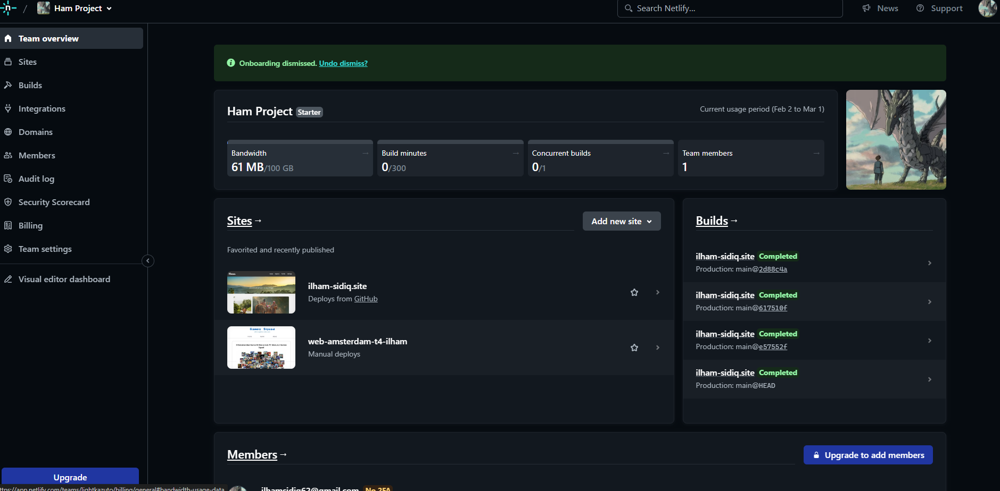
2. Click on **Add new site**
   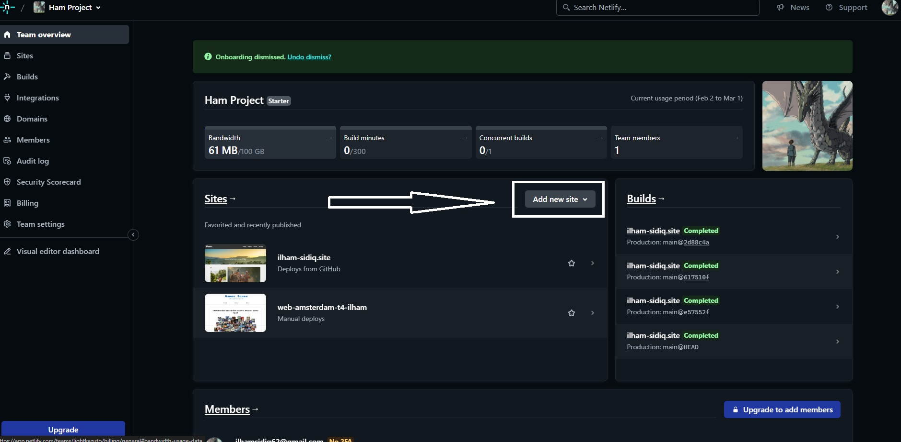
3. And then click on **Import an existing project**
   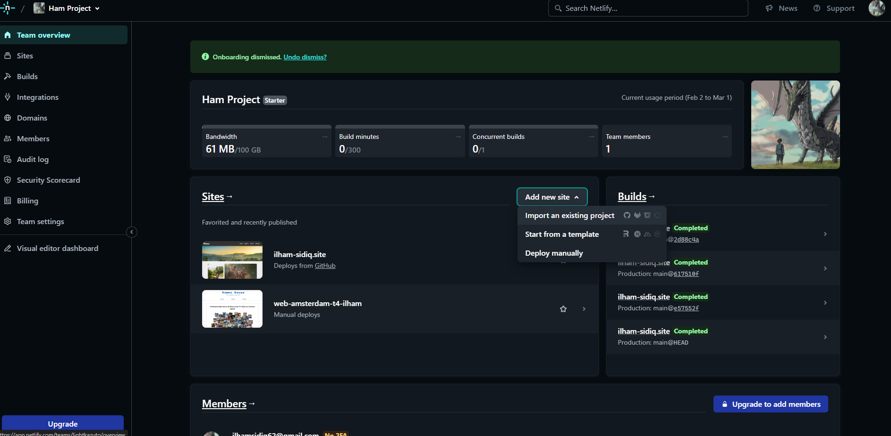
4. Then click **Deploy with Github**
   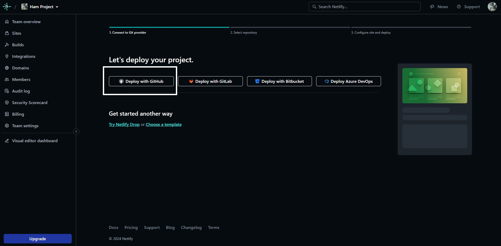
5. Chose repository what do you want to deploy
   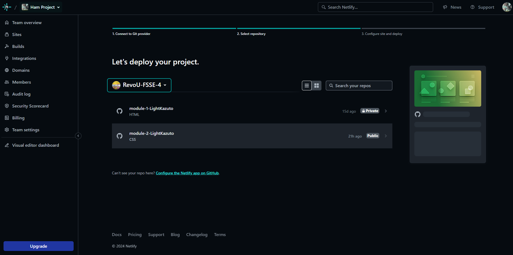
6. After that, fill section **site name**, give name like do you want and chose branch to deploy, in this case I want to deploy main branch.
   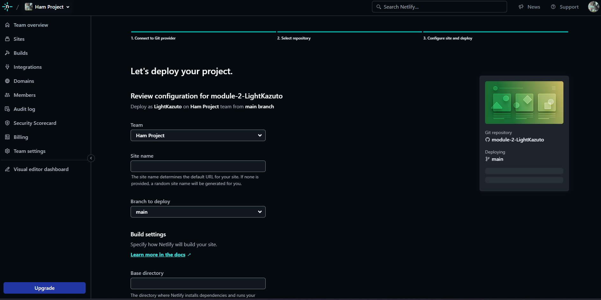
7. And then click **Deploy**
   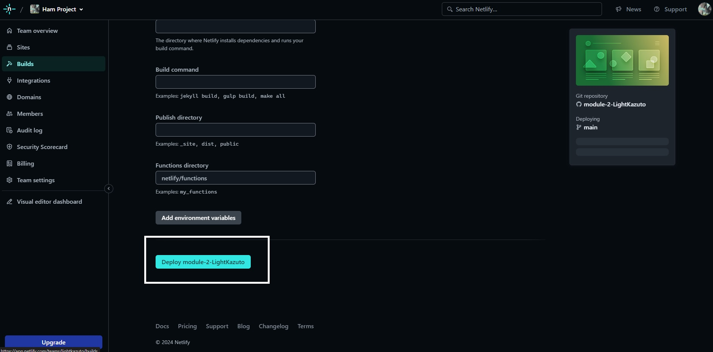
8. After you click **Deploy** and your site is in deployment progress like this and wait for a minute.
   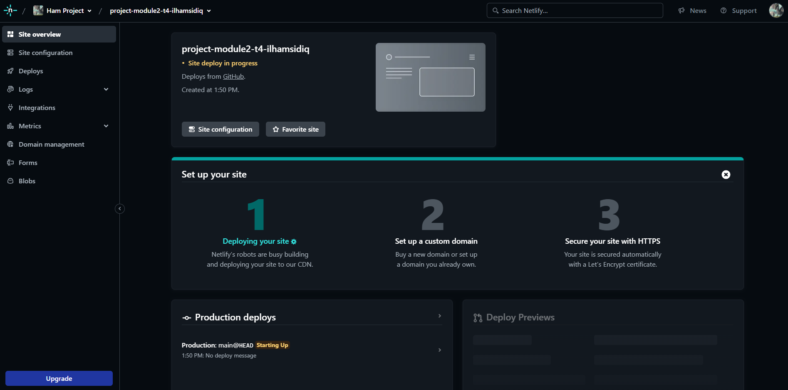
9. Refresh your browser after a minute and, violla your web site has been deploy.
   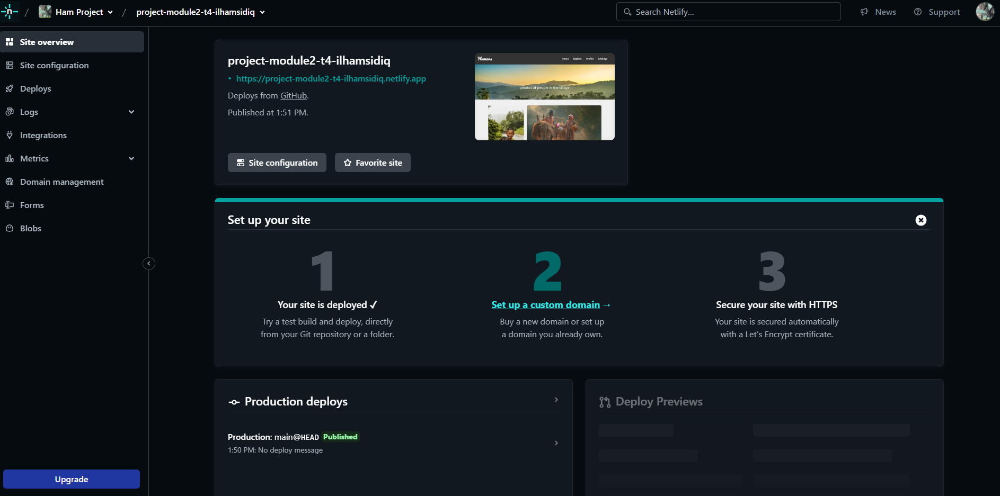

- **Connect our Custom Domain and DNS on Netlify**

1. Open your deployment who wanna se Custom Domain. and then click under number 2 **Set up a custom domain**
   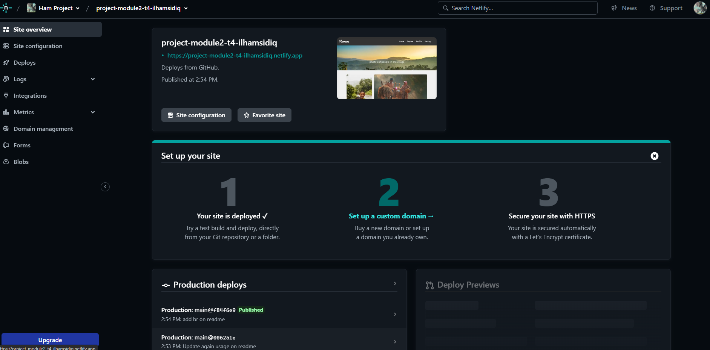
2. Fill box Custom domain or sub domain, in this case I am use **ilham-sidiq.site** after that click add domain.
   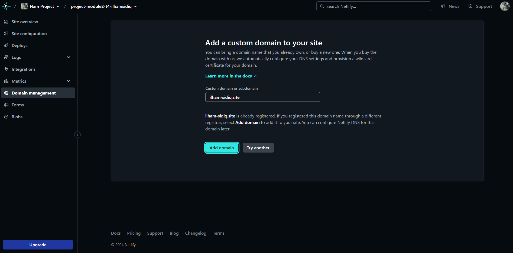
3. after that, copy your Name server (DNS) into your custom domain.
   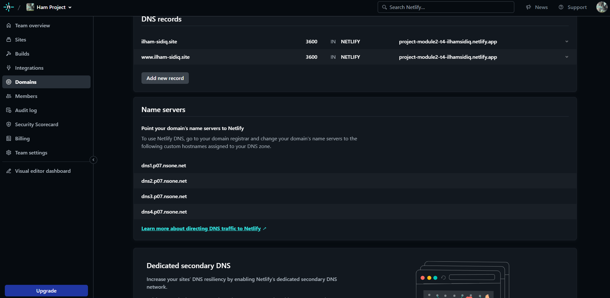
4. On this case I am buying Custom Domain in NIAGAHOSTER, add your DNS in niaga hoster to your Niaga hoster like this. and then click save
   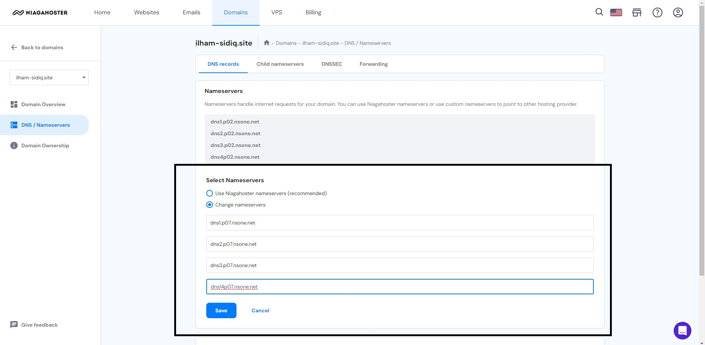
5. After you click save you have to wait for approximately 24 hours. <br>
6. Check periodically until the reading in the middle becomes a checklist.
   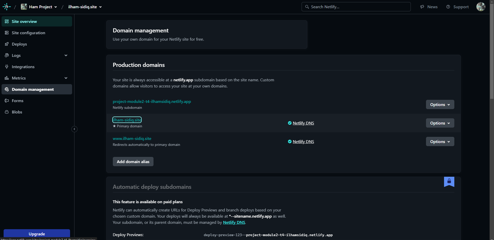
7. after your netlify DNS on checklist and boom your DNS has already published. Finished.
   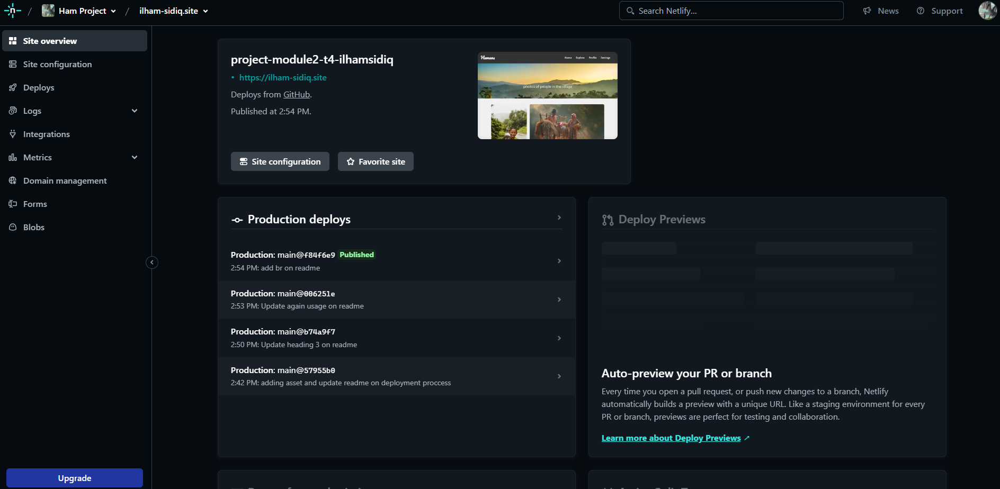
   <br>

- **For Someone wanna clone my repository**

1. Clone the repository

```bash
git clone https://github.com/RevoU-FSSE-4/module-2-LightKazuto.git
```

2. Open index.html (Recomedation to open in Google Chrome)
3. Enjoy Explore my Web.
   <br>

- **You can just Open my web with my Custom Domain Here**
  [here is the link](https://ilham-sidiq.site/)

  ## License

  This web has licensed bt owner Ilham Sidiq Dont try to copy or repost without permission author.
  you can contact author via Github : https://github.com/LightKazuto
